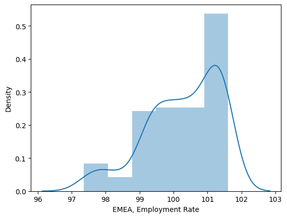
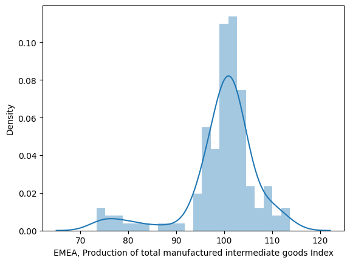
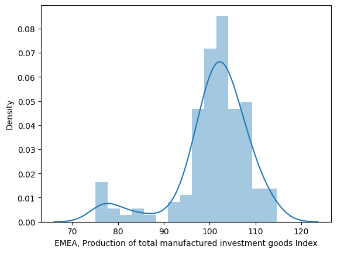
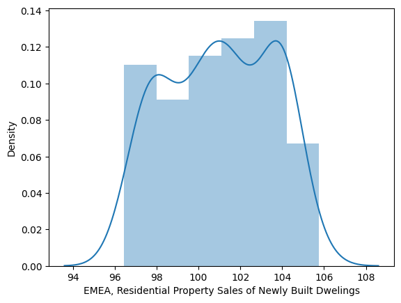
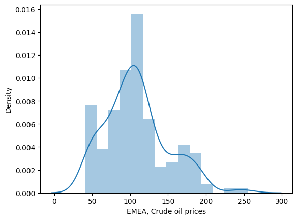
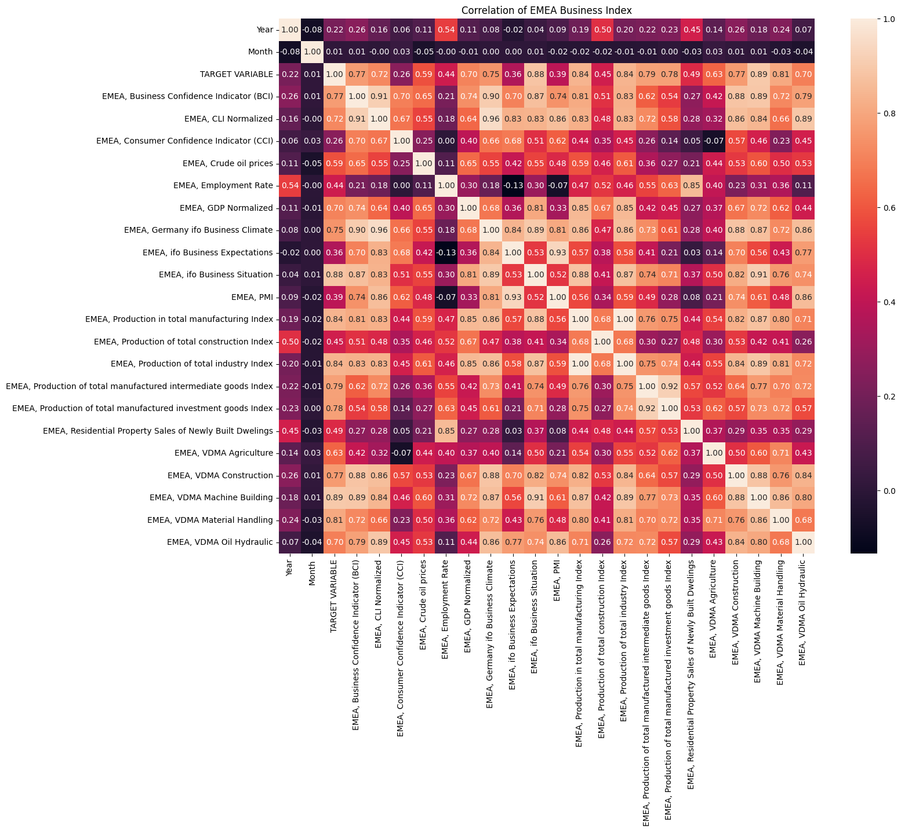
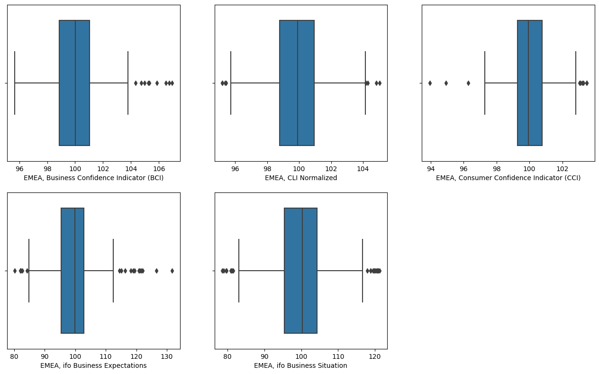
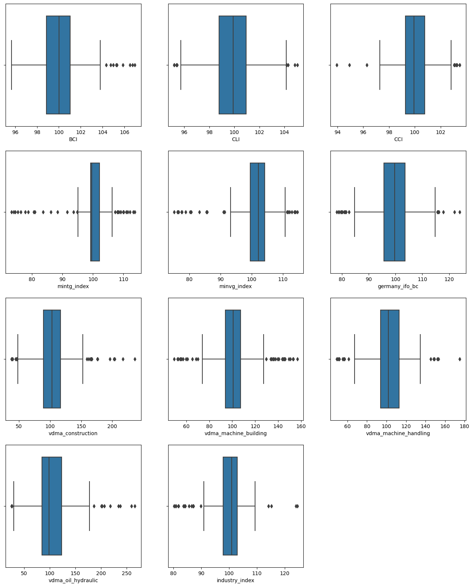
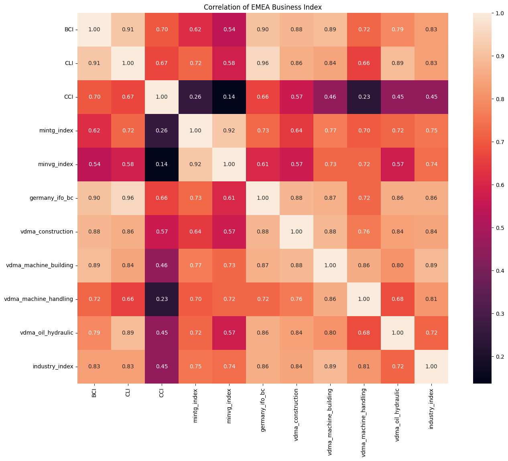
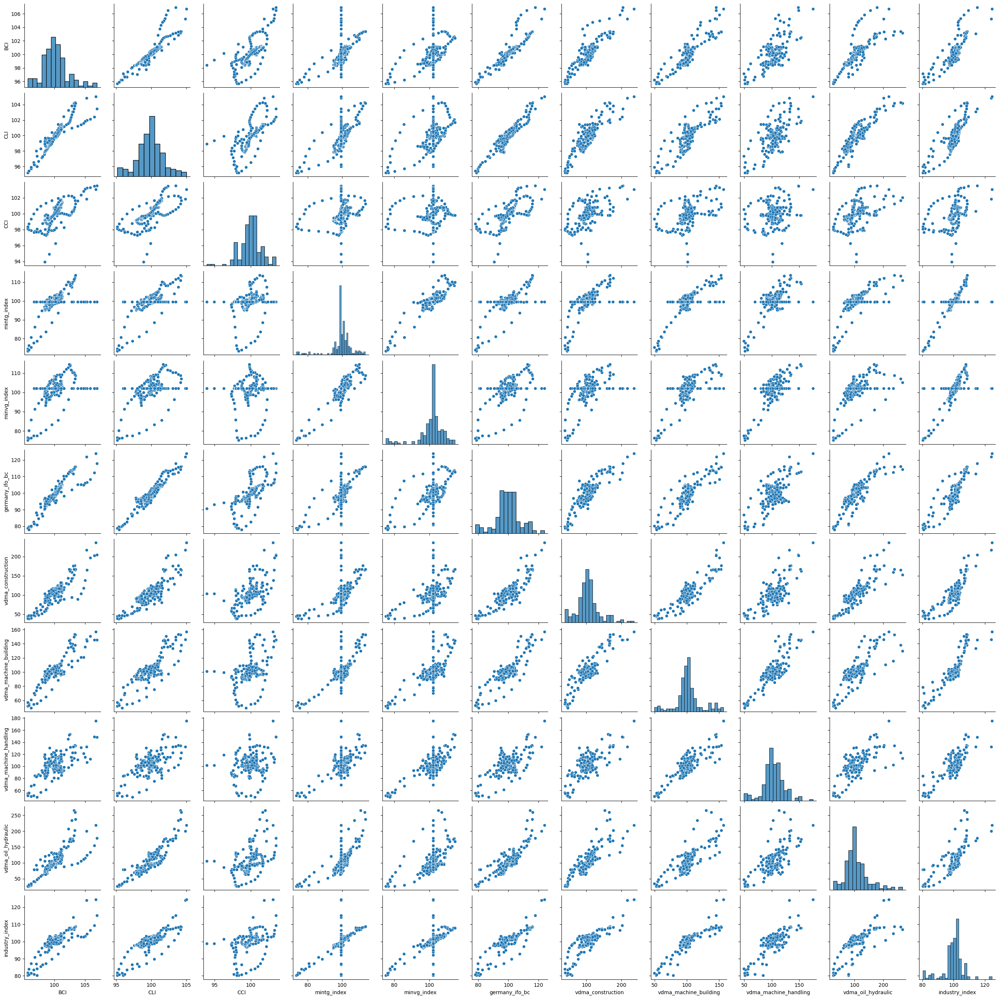

```python
import pandas as pd
import matplotlib.pyplot as plt
import seaborn as sns
```


```python
import warnings
warnings.filterwarnings("ignore")
```


```python
df = pd.read_excel('./EMEA_Rawdata_EXT-1.xlsx')
```


```python
df.head()
```


<div>
<style scoped>
    .dataframe tbody tr th:only-of-type {
        vertical-align: middle;
    }

    .dataframe tbody tr th {
        vertical-align: top;
    }

    .dataframe thead th {
        text-align: right;
    }
</style>
<table border="1" class="dataframe">
  <thead>
    <tr style="text-align: right;">
      <th></th>
      <th>Year</th>
      <th>Month</th>
      <th>TARGET VARIABLE</th>
      <th>EMEA, Business Confidence Indicator (BCI)</th>
      <th>EMEA, CLI Normalized</th>
      <th>EMEA, Consumer Confidence Indicator (CCI)</th>
      <th>EMEA, Crude oil prices</th>
      <th>EMEA, Employment Rate</th>
      <th>EMEA, GDP Normalized</th>
      <th>EMEA, Germany ifo Business Climate</th>
      <th>...</th>
      <th>EMEA, Production of total construction Index</th>
      <th>EMEA, Production of total industry Index</th>
      <th>EMEA, Production of total manufactured intermediate goods Index</th>
      <th>EMEA, Production of total manufactured investment goods Index</th>
      <th>EMEA, Residential Property Sales of Newly Built Dwelings</th>
      <th>EMEA, VDMA Agriculture</th>
      <th>EMEA, VDMA Construction</th>
      <th>EMEA, VDMA Machine Building</th>
      <th>EMEA, VDMA Material Handling</th>
      <th>EMEA, VDMA Oil Hydraulic</th>
    </tr>
  </thead>
  <tbody>
    <tr>
      <th>0</th>
      <td>2008</td>
      <td>3</td>
      <td>56.470288</td>
      <td>99.386446</td>
      <td>99.557885</td>
      <td>98.749106</td>
      <td>168.633416</td>
      <td>101.237421</td>
      <td>101.316538</td>
      <td>95.536268</td>
      <td>...</td>
      <td>100.982924</td>
      <td>102.760351</td>
      <td>102.130085</td>
      <td>105.519810</td>
      <td>103.477218</td>
      <td>152.230259</td>
      <td>78.222050</td>
      <td>101.729730</td>
      <td>109.491247</td>
      <td>99.525480</td>
    </tr>
    <tr>
      <th>1</th>
      <td>2008</td>
      <td>4</td>
      <td>58.276205</td>
      <td>99.252286</td>
      <td>99.302441</td>
      <td>98.489578</td>
      <td>170.615133</td>
      <td>101.084697</td>
      <td>101.189693</td>
      <td>95.020105</td>
      <td>...</td>
      <td>99.455811</td>
      <td>103.044570</td>
      <td>102.162637</td>
      <td>105.808424</td>
      <td>103.040339</td>
      <td>147.498286</td>
      <td>79.617964</td>
      <td>108.737317</td>
      <td>130.367913</td>
      <td>96.626406</td>
    </tr>
    <tr>
      <th>2</th>
      <td>2008</td>
      <td>5</td>
      <td>56.868989</td>
      <td>99.107791</td>
      <td>99.027786</td>
      <td>98.153161</td>
      <td>182.792208</td>
      <td>100.932420</td>
      <td>101.021160</td>
      <td>95.629424</td>
      <td>...</td>
      <td>97.941626</td>
      <td>101.939318</td>
      <td>100.863572</td>
      <td>104.296346</td>
      <td>102.608352</td>
      <td>139.180835</td>
      <td>74.803818</td>
      <td>102.905501</td>
      <td>109.939324</td>
      <td>87.821297</td>
    </tr>
    <tr>
      <th>3</th>
      <td>2008</td>
      <td>6</td>
      <td>56.320007</td>
      <td>98.953695</td>
      <td>98.723806</td>
      <td>97.763344</td>
      <td>190.765916</td>
      <td>100.780587</td>
      <td>100.801965</td>
      <td>94.756323</td>
      <td>...</td>
      <td>97.617816</td>
      <td>101.186758</td>
      <td>99.971225</td>
      <td>103.435500</td>
      <td>102.181175</td>
      <td>137.021093</td>
      <td>74.743418</td>
      <td>102.995057</td>
      <td>102.128778</td>
      <td>88.591610</td>
    </tr>
    <tr>
      <th>4</th>
      <td>2008</td>
      <td>7</td>
      <td>52.344385</td>
      <td>98.797412</td>
      <td>98.384961</td>
      <td>97.426953</td>
      <td>191.471205</td>
      <td>100.645817</td>
      <td>100.524887</td>
      <td>93.881988</td>
      <td>...</td>
      <td>97.589115</td>
      <td>99.193298</td>
      <td>98.533633</td>
      <td>100.565160</td>
      <td>101.651005</td>
      <td>126.194468</td>
      <td>66.202091</td>
      <td>91.503987</td>
      <td>85.019864</td>
      <td>79.475532</td>
    </tr>
  </tbody>
</table>
<p>5 rows × 24 columns</p>
</div>


```python
df.describe()
```


<div>
<style scoped>
    .dataframe tbody tr th:only-of-type {
        vertical-align: middle;
    }

    .dataframe tbody tr th {
        vertical-align: top;
    }

    .dataframe thead th {
        text-align: right;
    }
</style>
<table border="1" class="dataframe">
  <thead>
    <tr style="text-align: right;">
      <th></th>
      <th>Year</th>
      <th>Month</th>
      <th>TARGET VARIABLE</th>
      <th>EMEA, Business Confidence Indicator (BCI)</th>
      <th>EMEA, CLI Normalized</th>
      <th>EMEA, Consumer Confidence Indicator (CCI)</th>
      <th>EMEA, Crude oil prices</th>
      <th>EMEA, Employment Rate</th>
      <th>EMEA, GDP Normalized</th>
      <th>EMEA, Germany ifo Business Climate</th>
      <th>...</th>
      <th>EMEA, Production of total construction Index</th>
      <th>EMEA, Production of total industry Index</th>
      <th>EMEA, Production of total manufactured intermediate goods Index</th>
      <th>EMEA, Production of total manufactured investment goods Index</th>
      <th>EMEA, Residential Property Sales of Newly Built Dwelings</th>
      <th>EMEA, VDMA Agriculture</th>
      <th>EMEA, VDMA Construction</th>
      <th>EMEA, VDMA Machine Building</th>
      <th>EMEA, VDMA Material Handling</th>
      <th>EMEA, VDMA Oil Hydraulic</th>
    </tr>
  </thead>
  <tbody>
    <tr>
      <th>count</th>
      <td>173.000000</td>
      <td>173.000000</td>
      <td>173.000000</td>
      <td>173.000000</td>
      <td>173.000000</td>
      <td>173.000000</td>
      <td>172.000000</td>
      <td>134.000000</td>
      <td>173.000000</td>
      <td>173.000000</td>
      <td>...</td>
      <td>171.000000</td>
      <td>171.000000</td>
      <td>139.000000</td>
      <td>138.000000</td>
      <td>134.000000</td>
      <td>171.000000</td>
      <td>171.000000</td>
      <td>171.000000</td>
      <td>171.000000</td>
      <td>171.000000</td>
    </tr>
    <tr>
      <th>mean</th>
      <td>2014.878613</td>
      <td>6.456647</td>
      <td>51.725141</td>
      <td>100.165468</td>
      <td>99.911169</td>
      <td>99.955067</td>
      <td>108.435237</td>
      <td>100.267461</td>
      <td>99.799266</td>
      <td>99.665680</td>
      <td>...</td>
      <td>99.110029</td>
      <td>99.998665</td>
      <td>99.514440</td>
      <td>100.782788</td>
      <td>100.995202</td>
      <td>104.581690</td>
      <td>105.038129</td>
      <td>102.127317</td>
      <td>102.876076</td>
      <td>107.216767</td>
    </tr>
    <tr>
      <th>std</th>
      <td>4.186392</td>
      <td>3.429459</td>
      <td>11.779169</td>
      <td>2.055684</td>
      <td>1.853292</td>
      <td>1.466436</td>
      <td>41.132747</td>
      <td>1.088957</td>
      <td>3.153513</td>
      <td>8.265685</td>
      <td>...</td>
      <td>4.844012</td>
      <td>6.651863</td>
      <td>7.532978</td>
      <td>8.088812</td>
      <td>2.515453</td>
      <td>22.335711</td>
      <td>33.182226</td>
      <td>20.095164</td>
      <td>19.591777</td>
      <td>41.531314</td>
    </tr>
    <tr>
      <th>min</th>
      <td>2008.000000</td>
      <td>1.000000</td>
      <td>20.127824</td>
      <td>95.690428</td>
      <td>95.194252</td>
      <td>93.944354</td>
      <td>40.647561</td>
      <td>97.362329</td>
      <td>86.281709</td>
      <td>78.049565</td>
      <td>...</td>
      <td>81.492718</td>
      <td>80.244924</td>
      <td>73.384132</td>
      <td>75.120385</td>
      <td>96.432692</td>
      <td>52.173913</td>
      <td>38.325282</td>
      <td>49.435347</td>
      <td>48.908297</td>
      <td>25.925129</td>
    </tr>
    <tr>
      <th>25%</th>
      <td>2011.000000</td>
      <td>4.000000</td>
      <td>45.223723</td>
      <td>98.867598</td>
      <td>98.779094</td>
      <td>99.273158</td>
      <td>82.027291</td>
      <td>99.468618</td>
      <td>99.126682</td>
      <td>95.629424</td>
      <td>...</td>
      <td>95.921830</td>
      <td>97.915707</td>
      <td>98.053737</td>
      <td>98.570519</td>
      <td>98.705175</td>
      <td>91.913967</td>
      <td>89.015152</td>
      <td>93.725156</td>
      <td>93.814882</td>
      <td>85.104796</td>
    </tr>
    <tr>
      <th>50%</th>
      <td>2015.000000</td>
      <td>6.000000</td>
      <td>51.405531</td>
      <td>100.024729</td>
      <td>99.920269</td>
      <td>99.928411</td>
      <td>106.501051</td>
      <td>100.404376</td>
      <td>100.190961</td>
      <td>99.665775</td>
      <td>...</td>
      <td>99.268112</td>
      <td>100.968188</td>
      <td>100.863572</td>
      <td>102.100331</td>
      <td>101.116503</td>
      <td>99.567100</td>
      <td>102.601156</td>
      <td>100.911002</td>
      <td>102.091633</td>
      <td>98.219788</td>
    </tr>
    <tr>
      <th>75%</th>
      <td>2018.000000</td>
      <td>9.000000</td>
      <td>57.453146</td>
      <td>101.027189</td>
      <td>100.937885</td>
      <td>100.774643</td>
      <td>125.504250</td>
      <td>101.285165</td>
      <td>100.676776</td>
      <td>103.551278</td>
      <td>...</td>
      <td>102.015713</td>
      <td>102.973053</td>
      <td>103.007853</td>
      <td>105.431430</td>
      <td>103.456908</td>
      <td>119.743590</td>
      <td>116.931156</td>
      <td>107.602311</td>
      <td>113.114878</td>
      <td>123.806617</td>
    </tr>
    <tr>
      <th>max</th>
      <td>2022.000000</td>
      <td>12.000000</td>
      <td>81.893651</td>
      <td>106.939196</td>
      <td>105.027933</td>
      <td>103.489160</td>
      <td>254.561356</td>
      <td>101.608496</td>
      <td>110.900657</td>
      <td>123.970037</td>
      <td>...</td>
      <td>123.641102</td>
      <td>124.529812</td>
      <td>113.718002</td>
      <td>114.601585</td>
      <td>105.760494</td>
      <td>167.452077</td>
      <td>236.158192</td>
      <td>156.682028</td>
      <td>175.103734</td>
      <td>266.117065</td>
    </tr>
  </tbody>
</table>
<p>8 rows × 24 columns</p>
</div>


```python
df.isnull().sum()
```


    Year                                                                0
    Month                                                               0
    TARGET VARIABLE                                                     0
    EMEA, Business Confidence Indicator (BCI)                           0
    EMEA, CLI Normalized                                                0
    EMEA, Consumer Confidence Indicator (CCI)                           0
    EMEA, Crude oil prices                                              1
    EMEA, Employment Rate                                              39
    EMEA, GDP Normalized                                                0
    EMEA, Germany ifo Business Climate                                  0
    EMEA, ifo Business Expectations                                     0
    EMEA, ifo Business Situation                                        0
    EMEA, PMI                                                           0
    EMEA, Production in total manufacturing Index                       2
    EMEA, Production of total construction Index                        2
    EMEA, Production of total industry Index                            2
    EMEA, Production of total manufactured intermediate goods Index    34
    EMEA, Production of total manufactured investment goods Index      35
    EMEA, Residential Property Sales of Newly Built Dwelings           39
    EMEA, VDMA Agriculture                                              2
    EMEA, VDMA Construction                                             2
    EMEA, VDMA Machine Building                                         2
    EMEA, VDMA Material Handling                                        2
    EMEA, VDMA Oil Hydraulic                                            2
    dtype: int64


```python
print('Median :',df['EMEA, Employment Rate'].median())
sns.distplot(df['EMEA, Employment Rate'])
```

    Mean : 100.26746101491987
    Mean : 100.4043764098456
    


    <AxesSubplot:xlabel='EMEA, Employment Rate', ylabel='Density'>


    

    


```python
print('Mean :',df['EMEA, Production of total manufactured intermediate goods Index'].mean())
sns.distplot(df['EMEA, Production of total manufactured intermediate goods Index'])
```

    Mean : 99.51443961655384
    Median : 100.86357237650813
    


    <AxesSubplot:xlabel='EMEA, Production of total manufactured intermediate goods Index', ylabel='Density'>


    

    


```python
x = 'EMEA, Production of total manufactured investment goods Index'
print('Mean :',df[x].mean())
sns.distplot(df[x])
```

    Mean : 100.7827876363584
    Median : 102.10033114077632
    


    <AxesSubplot:xlabel='EMEA, Production of total manufactured investment goods Index', ylabel='Density'>


    

    


```python
x = 'EMEA, Residential Property Sales of Newly Built Dwelings'
print('Mean :',df[x].mean())
sns.distplot(df[x])
```

    Mean : 100.99520227279922
    Median : 101.11650292217311
    


    <AxesSubplot:xlabel='EMEA, Residential Property Sales of Newly Built Dwelings', ylabel='Density'>


    

    


```python
# x = df
# fig, axes = plt.subplots(ncols=2, figsize=(12, 4))
# for ax in axes:
#     sns.kdeplot(x, shade=False, color='crimson', ax=ax)
#     kdeline = ax.lines[0]
#     xs = kdeline.get_xdata()
#     ys = kdeline.get_ydata()
#     if ax == axes[0]:
#         middle = x.mean()
#         sdev = x.std()
#         left = middle - sdev
#         right = middle + sdev
#         ax.set_title('Showing mean and sdev')
#     else:
#         left, middle, right = np.percentile(x, [25, 50, 75])
#         ax.set_title('Showing median and quartiles')
#     ax.vlines(middle, 0, np.interp(middle, xs, ys), color='crimson', ls=':')
#     ax.fill_between(xs, 0, ys, facecolor='crimson', alpha=0.2)
#     ax.fill_between(xs, 0, ys, where=(left <= xs) & (xs <= right), interpolate=True, facecolor='crimson', alpha=0.2)
#     # ax.set_ylim(ymin=0)
# plt.show()
```


```python
# for index,col in df.iterrows():
#     if(df[index] )
list_for_replaceing_zero = ['EMEA, VDMA Agriculture',
'EMEA, VDMA Construction',                                             
'EMEA, VDMA Machine Building',                                         
'EMEA, VDMA Material Handling',                                        
'EMEA, VDMA Oil Hydraulic',
'EMEA, Production in total manufacturing Index',
'EMEA, Production of total construction Index',
'EMEA, Production of total industry Index']
for col in list_for_replaceing_zero:
    df[col] = df[col].replace(0, df[col].mean())
```


```python
x = 'EMEA, Production of total manufactured investment goods Index'
df[x] = df[x].replace(np.nan, df[x].median())
```


```python
x = 'EMEA, Employment Rate'
df[x] = df[x].replace(np.nan, df[x].median())
```


```python
x = 'EMEA, Production of total manufactured intermediate goods Index'
df[x] = df[x].replace(np.nan, df[x].mean())
```


```python
x = 'EMEA, Residential Property Sales of Newly Built Dwelings'
df[x] = df[x].replace(np.nan, df[x].mean())
```


```python
x = 'EMEA, Crude oil prices'
print('Mean :',df[x].mean())
sns.distplot(df[x])
```

    Mean : 108.43523655794415
    Median : 106.50105081408314
    


    <AxesSubplot:xlabel='EMEA, Crude oil prices', ylabel='Density'>


    

    


```python
x = 'EMEA, Crude oil prices'
df[x] = df[x].replace(np.nan, df[x].mean())
```


```python
df.isnull().sum()
```


    Year                                                               0
    Month                                                              0
    TARGET VARIABLE                                                    0
    EMEA, Business Confidence Indicator (BCI)                          0
    EMEA, CLI Normalized                                               0
    EMEA, Consumer Confidence Indicator (CCI)                          0
    EMEA, Crude oil prices                                             0
    EMEA, Employment Rate                                              0
    EMEA, GDP Normalized                                               0
    EMEA, Germany ifo Business Climate                                 0
    EMEA, ifo Business Expectations                                    0
    EMEA, ifo Business Situation                                       0
    EMEA, PMI                                                          0
    EMEA, Production in total manufacturing Index                      0
    EMEA, Production of total construction Index                       0
    EMEA, Production of total industry Index                           0
    EMEA, Production of total manufactured intermediate goods Index    0
    EMEA, Production of total manufactured investment goods Index      0
    EMEA, Residential Property Sales of Newly Built Dwelings           0
    EMEA, VDMA Agriculture                                             0
    EMEA, VDMA Construction                                            0
    EMEA, VDMA Machine Building                                        0
    EMEA, VDMA Material Handling                                       0
    EMEA, VDMA Oil Hydraulic                                           0
    dtype: int64


```python
df.head()
```


<div>
<style scoped>
    .dataframe tbody tr th:only-of-type {
        vertical-align: middle;
    }

    .dataframe tbody tr th {
        vertical-align: top;
    }

    .dataframe thead th {
        text-align: right;
    }
</style>
<table border="1" class="dataframe">
  <thead>
    <tr style="text-align: right;">
      <th></th>
      <th>Year</th>
      <th>Month</th>
      <th>TARGET VARIABLE</th>
      <th>EMEA, Business Confidence Indicator (BCI)</th>
      <th>EMEA, CLI Normalized</th>
      <th>EMEA, Consumer Confidence Indicator (CCI)</th>
      <th>EMEA, Crude oil prices</th>
      <th>EMEA, Employment Rate</th>
      <th>EMEA, GDP Normalized</th>
      <th>EMEA, Germany ifo Business Climate</th>
      <th>...</th>
      <th>EMEA, Production of total construction Index</th>
      <th>EMEA, Production of total industry Index</th>
      <th>EMEA, Production of total manufactured intermediate goods Index</th>
      <th>EMEA, Production of total manufactured investment goods Index</th>
      <th>EMEA, Residential Property Sales of Newly Built Dwelings</th>
      <th>EMEA, VDMA Agriculture</th>
      <th>EMEA, VDMA Construction</th>
      <th>EMEA, VDMA Machine Building</th>
      <th>EMEA, VDMA Material Handling</th>
      <th>EMEA, VDMA Oil Hydraulic</th>
    </tr>
  </thead>
  <tbody>
    <tr>
      <th>0</th>
      <td>2008</td>
      <td>3</td>
      <td>56.470288</td>
      <td>99.386446</td>
      <td>99.557885</td>
      <td>98.749106</td>
      <td>168.633416</td>
      <td>101.237421</td>
      <td>101.316538</td>
      <td>95.536268</td>
      <td>...</td>
      <td>100.982924</td>
      <td>102.760351</td>
      <td>102.130085</td>
      <td>105.519810</td>
      <td>103.477218</td>
      <td>152.230259</td>
      <td>78.222050</td>
      <td>101.729730</td>
      <td>109.491247</td>
      <td>99.525480</td>
    </tr>
    <tr>
      <th>1</th>
      <td>2008</td>
      <td>4</td>
      <td>58.276205</td>
      <td>99.252286</td>
      <td>99.302441</td>
      <td>98.489578</td>
      <td>170.615133</td>
      <td>101.084697</td>
      <td>101.189693</td>
      <td>95.020105</td>
      <td>...</td>
      <td>99.455811</td>
      <td>103.044570</td>
      <td>102.162637</td>
      <td>105.808424</td>
      <td>103.040339</td>
      <td>147.498286</td>
      <td>79.617964</td>
      <td>108.737317</td>
      <td>130.367913</td>
      <td>96.626406</td>
    </tr>
    <tr>
      <th>2</th>
      <td>2008</td>
      <td>5</td>
      <td>56.868989</td>
      <td>99.107791</td>
      <td>99.027786</td>
      <td>98.153161</td>
      <td>182.792208</td>
      <td>100.932420</td>
      <td>101.021160</td>
      <td>95.629424</td>
      <td>...</td>
      <td>97.941626</td>
      <td>101.939318</td>
      <td>100.863572</td>
      <td>104.296346</td>
      <td>102.608352</td>
      <td>139.180835</td>
      <td>74.803818</td>
      <td>102.905501</td>
      <td>109.939324</td>
      <td>87.821297</td>
    </tr>
    <tr>
      <th>3</th>
      <td>2008</td>
      <td>6</td>
      <td>56.320007</td>
      <td>98.953695</td>
      <td>98.723806</td>
      <td>97.763344</td>
      <td>190.765916</td>
      <td>100.780587</td>
      <td>100.801965</td>
      <td>94.756323</td>
      <td>...</td>
      <td>97.617816</td>
      <td>101.186758</td>
      <td>99.971225</td>
      <td>103.435500</td>
      <td>102.181175</td>
      <td>137.021093</td>
      <td>74.743418</td>
      <td>102.995057</td>
      <td>102.128778</td>
      <td>88.591610</td>
    </tr>
    <tr>
      <th>4</th>
      <td>2008</td>
      <td>7</td>
      <td>52.344385</td>
      <td>98.797412</td>
      <td>98.384961</td>
      <td>97.426953</td>
      <td>191.471205</td>
      <td>100.645817</td>
      <td>100.524887</td>
      <td>93.881988</td>
      <td>...</td>
      <td>97.589115</td>
      <td>99.193298</td>
      <td>98.533633</td>
      <td>100.565160</td>
      <td>101.651005</td>
      <td>126.194468</td>
      <td>66.202091</td>
      <td>91.503987</td>
      <td>85.019864</td>
      <td>79.475532</td>
    </tr>
  </tbody>
</table>
<p>5 rows × 24 columns</p>
</div>


```python
mask = np.zeros_like(df.corr(), dtype=np.bool)
mask[np.triu_indices_from(mask)] = True
plt.figure(figsize=(16,12))
plt.title('Correlation of EMEA Business Index')
ax = sns.heatmap(df.corr(), square=True,  fmt='.2f', annot=True, linecolor='white')
ax.set_xticklabels(ax.get_xticklabels(), rotation=90)
ax.set_yticklabels(ax.get_yticklabels(), rotation=0)           
plt.show()
```


    

    


```python
cols= ['EMEA, Business Confidence Indicator (BCI)',
'EMEA, CLI Normalized',
'EMEA, Consumer Confidence Indicator (CCI)',
      'EMEA, ifo Business Expectations',
      'EMEA, ifo Business Situation']
plt.figure(figsize=(16,30))
for i,col in enumerate(df[cols].columns):
    plt.subplot(6,3,i+1)
    
    sns.boxplot(data=df,x=col)
```


    

    


```python
df.columns
```


    Index(['Year', 'Month', 'TARGET VARIABLE',
           'EMEA, Business Confidence Indicator (BCI)', 'EMEA, CLI Normalized',
           'EMEA, Consumer Confidence Indicator (CCI)', 'EMEA, Crude oil prices',
           'EMEA, Employment Rate', 'EMEA, GDP Normalized',
           'EMEA, Germany ifo Business Climate', 'EMEA, ifo Business Expectations',
           'EMEA, ifo Business Situation', 'EMEA, PMI',
           'EMEA, Production in total manufacturing Index',
           'EMEA, Production of total construction Index',
           'EMEA, Production of total industry Index',
           'EMEA, Production of total manufactured intermediate goods Index',
           'EMEA, Production of total manufactured investment goods Index',
           'EMEA, Residential Property Sales of Newly Built Dwelings',
           'EMEA, VDMA Agriculture', 'EMEA, VDMA Construction',
           'EMEA, VDMA Machine Building', 'EMEA, VDMA Material Handling',
           'EMEA, VDMA Oil Hydraulic'],
          dtype='object')


```python
another_cols = ['BCI','CLI','CCI',
                'mintg_index',
                'minvg_index',
                'germany_ifo_bc',
                'vdma_construction',
                'vdma_machine_building',
                'vdma_machine_handling',
                'vdma_oil_hydraulic',
                'industry_index']
plt.figure(figsize=(16,30))
for i,col in enumerate(df[another_cols].columns):
    plt.subplot(6,3,i+1)
    
    sns.boxplot(data=df,x=col)
```


    

    


```python
mask = np.zeros_like(df.corr(), dtype=np.bool)
mask[np.triu_indices_from(mask)] = True
plt.figure(figsize=(16,12))
plt.title('Correlation of EMEA Business Index')
ax = sns.heatmap(df[another_cols].corr(), square=True,  fmt='.2f', annot=True, linecolor='white')
ax.set_xticklabels(ax.get_xticklabels(), rotation=90)
ax.set_yticklabels(ax.get_yticklabels(), rotation=0)           
plt.show()
```


    

    


```python
sns.pairplot(df[another_cols])
plt.show()
```


    

    


```python
from patsy import dmatrices
from statsmodels.stats.outliers_influence import variance_inflation_factor
```


```python
df.rename(columns = {'EMEA, ifo Business Situation':'ifo_bs','EMEA, Business Confidence Indicator (BCI)':'BCI',
                     "EMEA, CLI Normalized":"CLI",
                     "EMEA, Consumer Confidence Indicator (CCI)":"CCI",
                     "EMEA, Production of total manufactured intermediate goods Index":"mintg_index",
                     "EMEA, Production of total manufactured investment goods Index":"minvg_index",
                     "EMEA, Germany ifo Business Climate":"germany_ifo_bc",
                     'EMEA, VDMA Construction':"vdma_construction",
                     'EMEA, VDMA Machine Building':"vdma_machine_building",
                     'EMEA, VDMA Material Handling':"vdma_machine_handling",
                     'EMEA, VDMA Oil Hydraulic':"vdma_oil_hydraulic",
                     'EMEA, GDP Normalized':"GDP",
                     'EMEA, Production of total industry Index':'industry_index'
                    }, inplace = True)
```


```python
df.columns
```


    Index(['Year', 'Month', 'TARGET VARIABLE', 'BCI', 'CLI', 'CCI',
           'EMEA, Crude oil prices', 'EMEA, Employment Rate', 'GDP',
           'germany_ifo_bc', 'EMEA, ifo Business Expectations', 'ifo_bs',
           'EMEA, PMI', 'EMEA, Production in total manufacturing Index',
           'EMEA, Production of total construction Index', 'industry_index',
           'mintg_index', 'minvg_index',
           'EMEA, Residential Property Sales of Newly Built Dwelings',
           'EMEA, VDMA Agriculture', 'vdma_construction', 'vdma_machine_building',
           'vdma_machine_handling', 'vdma_oil_hydraulic'],
          dtype='object')


```python
y, X = dmatrices('ifo_bs ~ BCI+CLI+CCI+mintg_index+minvg_index+germany_ifo_bc+vdma_construction+vdma_machine_building+vdma_machine_handling+vdma_oil_hydraulic+industry_index', data=df, return_type='dataframe')

#calculate VIF for each explanatory variable
vif = pd.DataFrame()
vif['VIF'] = [variance_inflation_factor(X.values, i) for i in range(X.shape[1])]
vif['variable'] = X.columns
```


```python
vif
```


<div>
<style scoped>
    .dataframe tbody tr th:only-of-type {
        vertical-align: middle;
    }

    .dataframe tbody tr th {
        vertical-align: top;
    }

    .dataframe thead th {
        text-align: right;
    }
</style>
<table border="1" class="dataframe">
  <thead>
    <tr style="text-align: right;">
      <th></th>
      <th>VIF</th>
      <th>variable</th>
    </tr>
  </thead>
  <tbody>
    <tr>
      <th>0</th>
      <td>36437.140963</td>
      <td>Intercept</td>
    </tr>
    <tr>
      <th>1</th>
      <td>15.667783</td>
      <td>BCI</td>
    </tr>
    <tr>
      <th>2</th>
      <td>25.734172</td>
      <td>CLI</td>
    </tr>
    <tr>
      <th>3</th>
      <td>3.906233</td>
      <td>CCI</td>
    </tr>
    <tr>
      <th>4</th>
      <td>12.414092</td>
      <td>mintg_index</td>
    </tr>
    <tr>
      <th>5</th>
      <td>10.085800</td>
      <td>minvg_index</td>
    </tr>
    <tr>
      <th>6</th>
      <td>18.013872</td>
      <td>germany_ifo_bc</td>
    </tr>
    <tr>
      <th>7</th>
      <td>8.097798</td>
      <td>vdma_construction</td>
    </tr>
    <tr>
      <th>8</th>
      <td>13.868185</td>
      <td>vdma_machine_building</td>
    </tr>
    <tr>
      <th>9</th>
      <td>5.594963</td>
      <td>vdma_machine_handling</td>
    </tr>
    <tr>
      <th>10</th>
      <td>9.386626</td>
      <td>vdma_oil_hydraulic</td>
    </tr>
    <tr>
      <th>11</th>
      <td>9.150703</td>
      <td>industry_index</td>
    </tr>
  </tbody>
</table>
</div>


# MODEL


```python
from sklearn.model_selection import train_test_split
from sklearn.linear_model import LinearRegression

X_train, X_test, y_train, y_test = train_test_split(X, y, test_size = 0.6)
  
# Splitting the data into training and testing data
regr = LinearRegression()
  
regr.fit(X_train, y_train)
print(regr.score(X_test, y_test))
```

    0.8459129439769442
    


```python
len(y_test)
```


    104


```python
y_pred = regr.predict(X_test)
```


```python
print(len(X_test),len(y_test),len(y_pred))
```

    104 104 104
    


```python
from sklearn.metrics import mean_absolute_error,mean_squared_error
  
mae = mean_absolute_error(y_true=y_test,y_pred=y_pred)
#squared True returns MSE value, False returns RMSE value.
mse = mean_squared_error(y_true=y_test,y_pred=y_pred) #default=True
rmse = mean_squared_error(y_true=y_test,y_pred=y_pred,squared=False)
  
print("MAE:",mae)
print("MSE:",mse)
print("RMSE:",rmse)
```

    MAE: 2.438595369259478
    MSE: 11.146660341532778
    RMSE: 3.338661459557225
    


```python
X_test
```


<div>
<style scoped>
    .dataframe tbody tr th:only-of-type {
        vertical-align: middle;
    }

    .dataframe tbody tr th {
        vertical-align: top;
    }

    .dataframe thead th {
        text-align: right;
    }
</style>
<table border="1" class="dataframe">
  <thead>
    <tr style="text-align: right;">
      <th></th>
      <th>Intercept</th>
      <th>BCI</th>
      <th>CLI</th>
      <th>CCI</th>
      <th>mintg_index</th>
      <th>minvg_index</th>
      <th>germany_ifo_bc</th>
      <th>vdma_construction</th>
      <th>vdma_machine_building</th>
      <th>vdma_machine_handling</th>
      <th>vdma_oil_hydraulic</th>
      <th>industry_index</th>
    </tr>
  </thead>
  <tbody>
    <tr>
      <th>131</th>
      <td>1.0</td>
      <td>99.024828</td>
      <td>98.590559</td>
      <td>99.250891</td>
      <td>99.016026</td>
      <td>97.686899</td>
      <td>95.004773</td>
      <td>91.304348</td>
      <td>90.909091</td>
      <td>105.555556</td>
      <td>85.294118</td>
      <td>98.498592</td>
    </tr>
    <tr>
      <th>83</th>
      <td>1.0</td>
      <td>99.867840</td>
      <td>99.908364</td>
      <td>100.700707</td>
      <td>99.597042</td>
      <td>104.438082</td>
      <td>97.723524</td>
      <td>99.030787</td>
      <td>103.240109</td>
      <td>99.640875</td>
      <td>95.891257</td>
      <td>101.507366</td>
    </tr>
    <tr>
      <th>49</th>
      <td>1.0</td>
      <td>98.481567</td>
      <td>97.863164</td>
      <td>99.091196</td>
      <td>95.238091</td>
      <td>100.869880</td>
      <td>97.190461</td>
      <td>90.340254</td>
      <td>90.231440</td>
      <td>94.449641</td>
      <td>73.723849</td>
      <td>98.033989</td>
    </tr>
    <tr>
      <th>114</th>
      <td>1.0</td>
      <td>101.010070</td>
      <td>100.815830</td>
      <td>100.791176</td>
      <td>104.735284</td>
      <td>105.880410</td>
      <td>103.551278</td>
      <td>128.761984</td>
      <td>111.804808</td>
      <td>125.886232</td>
      <td>142.032164</td>
      <td>104.014478</td>
    </tr>
    <tr>
      <th>162</th>
      <td>1.0</td>
      <td>105.868385</td>
      <td>102.128378</td>
      <td>103.275920</td>
      <td>99.514440</td>
      <td>102.100331</td>
      <td>108.366534</td>
      <td>196.442688</td>
      <td>150.592885</td>
      <td>112.149533</td>
      <td>133.437500</td>
      <td>106.682659</td>
    </tr>
    <tr>
      <th>...</th>
      <td>...</td>
      <td>...</td>
      <td>...</td>
      <td>...</td>
      <td>...</td>
      <td>...</td>
      <td>...</td>
      <td>...</td>
      <td>...</td>
      <td>...</td>
      <td>...</td>
      <td>...</td>
    </tr>
    <tr>
      <th>10</th>
      <td>1.0</td>
      <td>96.242821</td>
      <td>95.731810</td>
      <td>97.914617</td>
      <td>80.683766</td>
      <td>85.681744</td>
      <td>79.684482</td>
      <td>39.749781</td>
      <td>61.032739</td>
      <td>67.214076</td>
      <td>30.135513</td>
      <td>87.212511</td>
    </tr>
    <tr>
      <th>135</th>
      <td>1.0</td>
      <td>98.627887</td>
      <td>98.566941</td>
      <td>99.598047</td>
      <td>99.715410</td>
      <td>95.426295</td>
      <td>96.022172</td>
      <td>92.857143</td>
      <td>92.261905</td>
      <td>100.578035</td>
      <td>66.666667</td>
      <td>97.076391</td>
    </tr>
    <tr>
      <th>146</th>
      <td>1.0</td>
      <td>97.167667</td>
      <td>96.007907</td>
      <td>98.067325</td>
      <td>99.514440</td>
      <td>102.100331</td>
      <td>80.856084</td>
      <td>58.571429</td>
      <td>78.476821</td>
      <td>83.928571</td>
      <td>79.141104</td>
      <td>80.244924</td>
    </tr>
    <tr>
      <th>43</th>
      <td>1.0</td>
      <td>99.597888</td>
      <td>99.471974</td>
      <td>99.041033</td>
      <td>101.655608</td>
      <td>106.413662</td>
      <td>97.880093</td>
      <td>116.363636</td>
      <td>104.403670</td>
      <td>115.446128</td>
      <td>105.357686</td>
      <td>101.950051</td>
    </tr>
    <tr>
      <th>151</th>
      <td>1.0</td>
      <td>99.130144</td>
      <td>99.656153</td>
      <td>97.980132</td>
      <td>99.514440</td>
      <td>102.100331</td>
      <td>98.061332</td>
      <td>110.067114</td>
      <td>92.041522</td>
      <td>113.013699</td>
      <td>124.528302</td>
      <td>94.909794</td>
    </tr>
  </tbody>
</table>
<p>104 rows × 12 columns</p>
</div>


